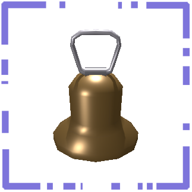
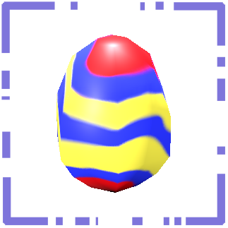
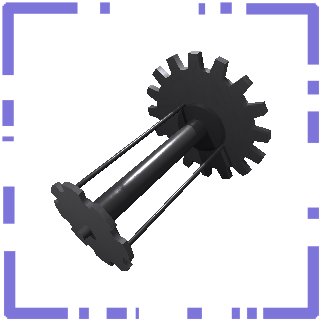
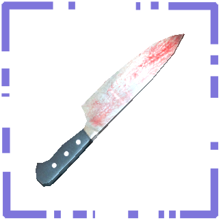
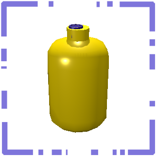
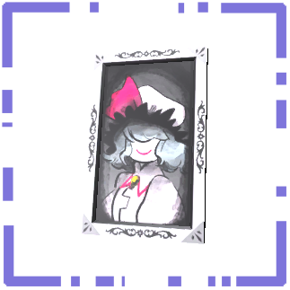

RuntimeIcons
============

  

#### ⚠️WARNING⚠️ this mod is currently in beta, future release might heavily change configs and/or rendered images

### Never lose track of your scrap again!

Runtime Icons brings a much-needed update to your hotbar! Enjoy breathtakingly-rendered scrap! With patent-pending technology your suit will scan each item you pick up and place its image on your hotbar so you know what to drop when that friendly neighborhood thumper rolls around the corner!

9/10 employees agree that with Runtime Icons, your productivity goes up up up, and you leave less blood on company scrap, which makes the Company happy!

## How it works

The first time an item that lacks an icon is spawned, it generates an icon to replace the gear icon in the HUD. These items are placed into the correct orientation (which can be overridden in the config) to properly display an image in the player's hotbar. This means any modded scrap should be compatible! Additional options are provided in the config.

**Note:** Modded scrap may not render if it has not been built correctly. Modders should refer to the [Mod Developer Information](#mod-developer-information) section.

Gameplay Images

 

## Config

The following options are provided:

- **Blacklist/whitelist items** - Select whether to blacklist or whitelist items, then create a list of items to use.
- **Manual icon overrides** - Provide a mapping from item name to file path to choose an icon on the disk to use as its icon, in the form `Item A: Path/To/Icon A.png, Item B: Path/To/Icon B.png`
- **Manual rotation per item** - Customize the rotation of individual items in their rendered icons, by specifying their rotation in the form `Item A:x,y,z|Item B:x,y,z`, where `|` is the item separator. A tool is accessible via LethalConfig to combine rotations into a final `x,y,z` value to use.
- **Adjust icon emptiness threshold** - Specify the amount of fully transparent pixels allowed before the icon is considered empty.
- **Dump sprites to disk** - This option can be used to collect all generated icons in the `BepInEx/cache` folder. They will be stored in both PNG and EXR, where EXR fully retains specular highlights on transparent objects.

## Mod Developer Information

### My custom item is invisible!

If an item you have created in the Unity editor without assigning an icon does not automatically receive an icon through Runtime Icons, please ensure that the HDRP's `Lit Shader Mode` is set to `Both`. This can be found under Edit → Project Settings → Quality → HDRP → Lit Shader Mode. This should be the default mode when using the Lethal Company Project Patcher.

**Technical explanation:** Due to a limitation in Lethal Company's HDRP settings, rendering a camera directly to a render texture with a transparent background results in an opaque image. To work around this, we have implemented a custom pass to render to a transparent render texture. However, custom passes are only able to render using the `Forward` mode, meaning that any objects that are built without those shaders will be invisible in the custom pass's output.